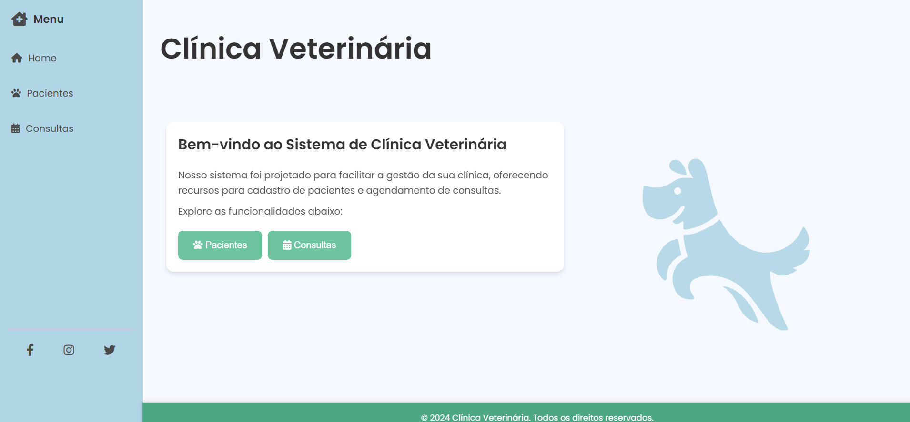

# Sistema de Clínica Veterinária

## Descrição do Projeto

Este projeto foi desenvolvido como trabalho de conclusão da disciplina Desenvolvimento de Aplicações Web. Trata-se de um sistema de veterinária simples e funcional, criado utilizando apenas HTML e CSS.

[🎥 Demonstração do Site](https://drive.google.com/file/d/1J95Del_eWY0F_KagKmvijoYCgtFKIFcw/view?usp=sharing)



```plaintext
├── index.html           # Página principal do site
├── style.css            # Estilos visuais do site
├── assets/
│   └── ClinicaVet.jpeg  # Imagem ilustrativa da clínica
